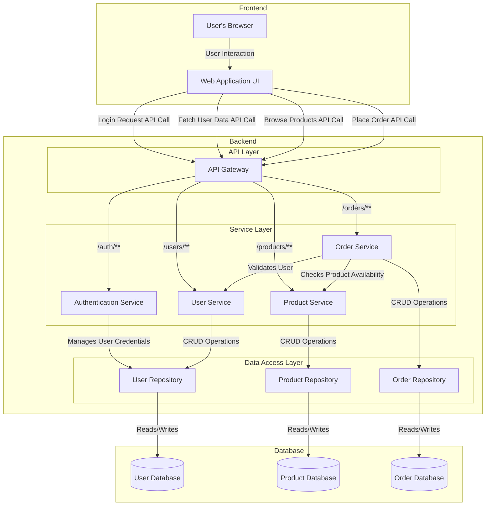

```mermaid
graph TD
    subgraph Frontend
        Browser[User's Browser]
        WebApp[Web Application UI]
    end

    subgraph Backend
        subgraph API Layer
            APIGateway[API Gateway]
        end
        subgraph Service Layer
            AuthService[Authentication Service]
            UserService[User Service]
            ProductService[Product Service]
            OrderService[Order Service]
        end
        subgraph Data Access Layer
            UserRepo[User Repository]
            ProductRepo[Product Repository]
            OrderRepo[Order Repository]
        end
    end

    subgraph Database
        UserDB[(User Database)]
        ProductDB[(Product Database)]
        OrderDB[(Order Database)]
    end

    %% Frontend Interactions
    Browser -- User Interaction --> WebApp

    %% API Calls from Frontend to Backend
    WebApp -- Login Request API Call --> APIGateway
    WebApp -- Fetch User Data API Call --> APIGateway
    WebApp -- Browse Products API Call --> APIGateway
    WebApp -- Place Order API Call --> APIGateway

    %% API Gateway to Backend Services
    APIGateway -- /auth/** --> AuthService
    APIGateway -- /users/** --> UserService
    APIGateway -- /products/** --> ProductService
    APIGateway -- /orders/** --> OrderService

    %% Backend Service Interactions (Example: Order service might need user and product info)
    OrderService -- Validates User --> UserService
    OrderService -- Checks Product Availability --> ProductService
    AuthService -- Manages User Credentials --> UserRepo

    %% Backend Repositories to Database
    UserService -- CRUD Operations --> UserRepo
    ProductService -- CRUD Operations --> ProductRepo
    OrderService -- CRUD Operations --> OrderRepo

    UserRepo -- Reads/Writes --> UserDB
    ProductRepo -- Reads/Writes --> ProductDB
    OrderRepo -- Reads/Writes --> OrderDB
```
