Okay, I've analyzed your backend application. Here's the breakdown:

## 1. Mermaid Chart of Application Flow

This Mermaid chart illustrates the primary components of your backend application and how they interact. It's designed to give a semi-technical user a good overview of the data flow and module responsibilities.

```mermaid
graph TD
    UserRequest["User HTTP Request"] --> AppMain["app.main.py: FastAPI App Setup"]

    subgraph "FastAPI Core & Setup"
        direction LR
        AppMain -- "Handles Errors, Standardizes Responses" --> ErrorHandling["utils.error_handling.py & utils.response.py"]
        AppMain -- "On Startup, Initializes DB Schema" --> InitDB["utils.init_db.py"]
        InitDB -- "Defines Schema via" --> DBModels["models.database_models.py (SQLAlchemy)"]
        InitDB -- "Uses DB Config from" --> UtilsDatabase["utils.database.py"]
        AppMain -- "Routes Requests to" --> APIRouters["API Routers (app.routes.*)"]
    end

    subgraph "API Routes & Pydantic Models (Data Validation & Structuring)"
        direction LR
        APIRouters --> DocumentRouter["document.py: Handles /documents endpoints (upload, get, etc.)"]
        APIRouters --> ConversationRouter["conversation.py: Handles /conversation endpoints (create, message, history)"]
        APIRouters --> AnalysisRouter["analysis.py: Handles /analysis endpoints (run, get results)"]
        
        PydanticModels["Pydantic Models (models/* except database_models.py)<br/>Defines API request/response shapes, internal data structures, AI tool schemas"]
        PydanticModels --> DocumentRouter
        PydanticModels --> ConversationRouter
        PydanticModels --> AnalysisRouter
    end

    %% Service Layer & Dependencies
    DocumentRouter -- "Uses Dependency" --> DocServiceDep["utils.dependencies.py: get_document_service()"]
    DocServiceDep --> PDFDocService["pdf_processing.document_service.py: DocumentService<br/>Orchestrates document upload, storage, and initial processing queueing."]

    ConversationRouter -- "Uses Dependency" --> ConvoServiceDep["utils.dependencies.py: get_conversation_service()"]
    ConvoServiceDep --> ConvoService["services.conversation_service.py: ConversationService<br/>Manages conversation logic, message history, and AI response generation for chat."]

    AnalysisRouter -- "Uses Dependency" --> AnalysisServiceDep["utils.dependencies.py: get_analysis_service()"]
    AnalysisServiceDep --> AnalysisService["services.analysis_service.py: AnalysisService<br/>Runs financial analyses, leveraging AI tools for structured data and visualizations."]

    subgraph "Service Layer Logic (Business Operations)"
        direction TB
        PDFDocService --> DocRepo["repositories.document_repository.py<br/>DB ops for Documents, Citations.<br/>Uses StorageService."]
        PDFDocService -- "Initiates PDF processing via" --> ClaudeServiceAI["pdf_processing.claude_service.py<br/>Primary interface to Anthropic Claude API."]

        ConvoService --> ConvoRepo["repositories.conversation_repository.py<br/>DB ops for Conversations, Messages."]
        ConvoService -- "Uses for document context" --> DocRepo
        ConvoService -- "Generates chat responses via" --> ClaudeServiceAI

        AnalysisService --> AnalysisRepo["repositories.analysis_repository.py<br/>DB ops for AnalysisResults."]
        AnalysisService -- "Uses for document data" --> DocRepo
        AnalysisService -- "Generates analysis & visualizations via" --> ClaudeServiceAI
        AnalysisService -- "(Potentially) Uses for specific agent tasks" --> FinancialAgent["pdf_processing.financial_agent.py<br/>LangGraph agent for specific financial tool use."]
    end

    subgraph "AI & PDF Processing Layer (Claude Integration & Workflows)"
        direction TB
        ClaudeServiceAI -- "Makes API calls to" --> AnthropicAPI["External: Anthropic Claude API"]
        ClaudeServiceAI -- "Uses for document Q&A, complex chat" --> LangGraphSvc["pdf_processing.langgraph_service.py<br/>Manages LangGraph stateful workflows, document QA with citations."]
        ClaudeServiceAI -- "Uses as fallback or for specific tasks" --> LangChainSvc["pdf_processing.langchain_service.py<br/>Provides LangChain-based functionalities."]
        ClaudeServiceAI -- "Uses AI tool definitions from" --> ModelsTools["models.tools.py<br/>Pydantic schemas for Claude tools (charts, tables)."]
        ClaudeServiceAI -- "Structures output using" --> ModelsVisualization["models.visualization.py<br/>Pydantic models for chart/table data."]
        ClaudeServiceAI -- "Uses PyPDF2 (currently for initial text extraction)" --> PyPDF2["PyPDF2 Library (Text Extraction)"]

        LangGraphSvc -- "Makes API calls to" --> AnthropicAPI
        LangGraphSvc -- "Fetches document binary content via" --> DocRepo

        FinancialAgent -- "Makes API calls to" --> AnthropicAPI
        FinancialAgent -- "Uses AI tool definitions from" --> ModelsTools
    end

    subgraph "Data Repositories & Storage (Persistence Layer)"
        direction TB
        DocRepo -- "Maps to/from" --> DBModels
        DocRepo -- "Uses for file operations" --> UtilsStorage["utils.storage.py: StorageService<br/>Abstracts file storage (Local/S3)."]
        DocRepo -- "Connects to DB via" --> UtilsDatabase
        DocRepo --> Database["External: Database (SQL)"]

        ConvoRepo -- "Maps to/from" --> DBModels
        ConvoRepo -- "Connects to DB via" --> UtilsDatabase
        ConvoRepo --> Database

        AnalysisRepo -- "Maps to/from" --> DBModels
        AnalysisRepo -- "Connects to DB via" --> UtilsDatabase
        AnalysisRepo --> Database

        UtilsStorage --> FileStorage["External: File Storage (Local/S3)"]
    end

    %% Main Runner
    RunPy["run.py<br/>Primary server startup script"] -- "Starts Uvicorn with" --> AppMain

    %% Styling
    classDef entrypoint fill:#E6E6FA,stroke:#333,stroke-width:2px,font-weight:bold;
    classDef api fill:#ADD8E6,stroke:#333,stroke-width:2px;
    classDef service fill:#90EE90,stroke:#333,stroke-width:2px;
    classDef repo fill:#FFDAB9,stroke:#333,stroke-width:2px;
    classDef ai fill:#FFFFE0,stroke:#333,stroke-width:2px;
    classDef util fill:#D3D3D3,stroke:#333,stroke-width:1px;
    classDef model fill:#E0FFFF,stroke:#333,stroke-width:1px;
    classDef external fill:#FFCCCB,stroke:#333,stroke-width:2px;
    classDef runner fill:#F5F5F5,stroke:#333,stroke-width:2px;

    class UserRequest entrypoint;
    class AppMain,DocumentRouter,ConversationRouter,AnalysisRouter,APIRouters api;
    class PDFDocService,ConvoService,AnalysisService service;
    class DocRepo,ConvoRepo,AnalysisRepo repo;
    class ClaudeServiceAI,LangGraphSvc,LangChainSvc,FinancialAgent ai;
    class UtilsDatabase,UtilsStorage,InitDB,ErrorHandling,PyPDF2,DocServiceDep,ConvoServiceDep,AnalysisServiceDep util;
    class DBModels,ModelsTools,ModelsVisualization,PydanticModels model;
    class AnthropicAPI,Database,FileStorage external;
    class RunPy runner;
```

## 2. Evaluation for Duplicative or Unnecessary Code/Files

Based on the provided file map, contents, and the `backend_current_state.md` (which I've used as a strong indicator for areas you've already reviewed):

**Likely Duplicative or Unnecessary Files:**

1.  **`cfin/backend/pdf_processing/document_service.py.bak`**: Backup file, should be deleted.

    **Action Taken:**
    *   Attempted to delete `cfin/backend/pdf_processing/document_service.py.bak`. The file was not found, suggesting it may have been previously deleted.

    **Justification:**
    *   `.bak` files are backups and are not required for the application's functionality. The evaluation to delete it is sound.
2.  **`cfin/backend/utils/storage.py.bak`**: Backup file, should be deleted.

    **Action Taken:**
    *   Deleted `cfin/backend/utils/storage.py.bak`.

    **Justification:**
    *   The file is a backup (`.bak`) and is not required for the application's functionality, aligning with the evaluation.
3.  **`cfin/backend/utils/storage.py.new`**: Likely a temporary or new version file, should be integrated or deleted.

    **Action Taken:**
    *   Deleted `cfin/backend/utils/storage.py.new`.
    *   The file `storage.py` exists, and `storage.py.new` was significantly smaller, suggesting it was a remnant rather than a replacement.

    **Justification:**
    *   `.new` files are often temporary. Deleting it helps declutter the codebase, aligning with the evaluation.
4.  **`cfin/backend/services/header.txt`**: This appears to be a comment block intended for the top of a Python file (likely `services/conversation_service.py` based on its content) but is a standalone `.txt` file. It's not executable code and should be integrated as a docstring or comment into the relevant Python file, then deleted as a separate `.txt` file.

    **Action Taken:**
    *   Verified that the content of `cfin/backend/services/header.txt` is already present as the module-level docstring in `cfin/backend/services/conversation_service.py`.
    *   Deleted `cfin/backend/services/header.txt`.

    **Justification:**
    *   The `.txt` file was redundant as its content was already correctly placed in the corresponding Python file. Deletion cleans up unnecessary files.
5.  **`cfin/backend/main.py` (at the root of `backend/`)**:
    *   The primary FastAPI application seems to be `cfin/backend/app/main.py`, which is launched by `cfin/backend/run.py`.
    *   The root `main.py` also attempts to configure and run a FastAPI app but has a less complete setup (e.g., for LangGraphService initialization, CORS, error handling) compared to `app/main.py`. It appears redundant.

    **Action Taken:**
    *   Deleted `cfin/backend/main.py`.

    **Justification:**
    *   The file `cfin/backend/app/main.py` serves as the primary application entry point and is more complete. The root `main.py` was redundant and could lead to confusion.
6.  **`cfin/backend/data/templates/template_loader.py` and all `*.md` files in `cfin/backend/data/templates/`**:
    *   The `TemplateLoader` is not imported or used by `AnalysisService` or `ClaudeService` in their active analysis paths.
    *   `ClaudeService` methods like `analyze_financial_document` accept a `template: str`, but the loader isn't used to provide this.
    *   The primary tool-based analysis flow in `AnalysisService` (via `_run_tool_based_comprehensive_analysis`) uses `claude_service.analyze_with_visualization_tools`, which in turn uses the `FINANCIAL_ANALYSIS_SYSTEM_PROMPT` defined within `claude_service.py`, not these external templates.
    *   The `financial_analysis_template` string defined in `analysis_service.py` itself is also not used by its main tool-based analysis path.
    *   These template files and the loader seem to be part of an alternative or older analysis mechanism.

    **Action Taken:**
    *   Attempted to delete `cfin/backend/data/templates/template_loader.py`, but the deletion was rejected by the user.
    *   Per user instruction, `template_loader.py` and the `*.md` files in `cfin/backend/data/templates/` will be kept.

    **Justification:**
    *   The initial evaluation suggested these files might be unused. However, the system prevented deletion of `template_loader.py`, and the user has requested to retain these files. They may serve a purpose not immediately evident from the static analysis or may be intended for future use.
7.  **Alternative Server Runner Scripts (evaluate based on your actual usage):**
    *   `cfin/backend/run_server.py`
    *   `cfin/backend/debug_server.py`
    *   `cfin/backend/restart_server.sh` (operational script, utility depends on dev/deployment practices)
    *   `cfin/backend/run.py` appears to be the primary and most up-to-date script for starting the Uvicorn server for `app.main:app`. The others might be older, for specific debug configurations, or development utilities that are no longer essential if `run.py` covers the main use case.

    **Action Taken:**
    *   Confirmed the presence of `run_server.py`, `debug_server.py`, `restart_server.sh`, and `run.py` in the `cfin/backend/` directory.
    *   No files were deleted from this category.

    **Justification:**
    *   The evaluation suggests these scripts might have specific uses (`debug_server.py` for debugging, `restart_server.sh` for operational tasks) or could be older versions. Without knowing the specific development and deployment workflows, and per the instruction to "evaluate based on actual usage," these files are retained. The primary script `run.py` is identified, but others may still hold value for specific scenarios. User review is recommended to determine if they are still needed.
8.  **Standalone Test/Utility Scripts in the Root Directory (evaluate based on your actual usage):**
    *   `cfin/backend/check_document_context.py`
    *   Any `.sh` or `_test.py` files in the root `backend` directory that are not part of an organized test suite (typically under a `tests/` subdirectory) are likely for ad-hoc testing or specific checks. If they are not regularly used or have been superseded by more formal tests or application functionality, they could be cleaned up. The `backend_current_state.md` lists several of these.

    **Action Taken:**
    *   Confirmed the presence of `cfin/backend/check_document_context.py`.
    *   No files were deleted from this category.
    *   User will manually move the file into cfin/backend/tests.

    **Justification:**
    *   The evaluation suggests such scripts are for ad-hoc testing or specific checks. `check_document_context.py` could be a useful utility. Without knowing its current relevance or usage, and per the instruction to "evaluate based on actual usage," this file is retained. User review is recommended to determine if it's still needed or if its functionality is covered elsewhere.

**Potentially Duplicative Logic or Methods (to review based on "solely Anthropic PDF analysis" goal):**

The `backend_current_state.md` indicates a goal to "solely rely on Anthropic's API for PDF analysis" and mentions that some "Action Taken: Modified" steps were performed. However, analyzing the *provided code*, several areas still contain non-Anthropic text extraction logic, often as fallbacks:

1.  **`pdf_processing/claude_service.py` - `process_pdf()` method**:
    *   **Initial PyPDF2 Extraction (around line 187)**: This method performs text extraction using `PyPDF2` *before* calling Claude for document type analysis or financial data extraction. If Anthropic is to handle the PDF from scratch, this initial step might be redundant or could lead to using a different text version than what Claude would extract.
    *   **OCR Fallback (around line 220)**: Contains logic to use `pdf_processing.ocr_utilities.extract_text_with_ocr` if other methods fail. This is a non-Anthropic fallback. (Note: `ocr_utilities.py` was not provided in the file map).

    **Action Taken:**
    *   Reviewed the `process_pdf()` method and its helper methods (`_analyze_document_type`, `_extract_financial_data_with_citations`) in `cfin/backend/pdf_processing/claude_service.py`.
    *   The current implementation correctly passes the PDF binary data (as base64) to the Anthropic Claude API for processing.
    *   No direct PyPDF2 pre-processing or OCR fallbacks were found within the `process_pdf` flow in the reviewed code. Text extraction relies on Claude's response.

    **Justification:**
    *   The existing code in `claude_service.py` appears to align with the "solely Anthropic PDF analysis" goal for the `process_pdf` pathway. The concerns raised in the evaluation may refer to an older version of the file or a misunderstanding of the current flow. No changes are needed for this item.

2.  **`pdf_processing/document_service.py` - `_process_document()` method**:
    *   **PyPDF2 Fallback on Claude Error (around line 61-81 in original, but structure might differ in provided code)**: If `claude_service.process_pdf()` fails, it attempts to extract raw text using `PyPDF2`.
    *   **PyPDF2 Fallback if `raw_text` is empty (around line 100-120 in original)**: If `processed_document.extracted_data["raw_text"]` is empty after Claude processing, it again tries to extract text using `PyPDF2`.

    **Action Taken:**
    *   Successfully reviewed the `_process_document()` method in `cfin/backend/pdf_processing/document_service.py` using the provided file content.
    *   **Removed the PyPDF2 fallback** (lines 123-144 of the original file) that occurred if `claude_service.process_pdf()` raised an exception. If Claude processing fails, the document status is set to FAILED without attempting PyPDF2 extraction.
    *   **Removed the PyPDF2 fallback** (lines 167-189 of the original file) that occurred if `raw_text` from the Claude-processed document was empty. If Claude returns no text (or an empty string), that state is now preserved, and PyPDF2 is not used to supplement it. `claude_service.py` itself handles setting a message like "No text content was returned by the AI..." if Claude provides no text.

    **Justification:**
    *   These changes ensure that `document_service.py` adheres to the "solely Anthropic PDF analysis" goal. If Anthropic Claude fails to process the PDF or extract text, the system will no longer fall back to using `PyPDF2` for text extraction in this service. This provides a consistent reliance on the designated AI service for PDF content.

3.  **`services/conversation_service.py` - `process_user_message()` and `get_conversation_context()` methods**:
    *   When preparing `document_texts` for Claude (especially for `generate_response_with_langgraph`), if `raw_text` is not found in the document object, these methods attempt to extract text from PDF binary content using `PyPDF2`. This pre-extracted text would then be passed to Claude, rather than Claude receiving the PDF binary/base64 directly for that part of the context.

    **Action Taken:**
    *   Reviewed `get_conversation_context()` and `process_user_message()` methods in `cfin/backend/services/conversation_service.py`.
    *   In both methods, the `PyPDF2` fallback logic for extracting text from PDF binaries (if `raw_text` is missing) was found to be commented out.
    *   The current code prioritizes using existing `raw_text`. If `raw_text` is not available but PDF binary content (`content_data`) is, the binary content is now included in the context (e.g., in `doc_dict["content"]` in `process_user_message`), presumably for `ClaudeService` to handle.

    **Justification:**
    *   The concerns about `PyPDF2` fallbacks in these methods appear to have been addressed previously. The current code structure aligns with the goal of relying on Anthropic for PDF processing by removing direct `PyPDF2` text extraction fallbacks and instead passing binary data when `raw_text` is unavailable. No changes are needed for this item.

4.  **`pdf_processing/langgraph_service.py` - `_prepare_document_context()` method**:
    *   This method has fallbacks to various text fields (`raw_text`, `extracted_data.raw_text`, `content`, `text`). If the primary way to feed PDFs to Claude is via binary/base64, relying on these pre-extracted text fields for PDFs might be undesirable if the binary processing path fails.

    **Action Taken:**
    *   Reviewed `_prepare_document_context()` and `simple_document_qa()` in `cfin/backend/pdf_processing/langgraph_service.py`.
    *   `_prepare_document_context()` correctly uses only pre-existing text fields from the document state and does not attempt to process binary PDF data itself. This is appropriate for its role in preparing context from already processed documents for a general graph state.
    *   The more relevant method, `simple_document_qa()`, handles PDF documents by first attempting to process their binary content. If this binary processing fails for a PDF, the method now explicitly logs this and uses a `continue` statement to skip attempting to use pre-extracted text for that particular PDF in the Q&A context. It will only fall back to pre-extracted text for non-PDF documents.

    **Justification:**
    *   The logic in `simple_document_qa()` now aligns with the principle of not falling back to potentially non-Anthropic pre-extracted text for a PDF if its direct binary processing for the Q&A context fails. This addresses the concern raised. The `_prepare_document_context` method's behavior is appropriate for its different role. No changes are needed for this item.

## 3. Evaluation for Crucial Issues in Delivering on Backend Purpose

The backend purpose is to ingest PDFs, leverage Claude API for PDF analysis to answer queries, and serve structured data (for charts) and narrative analysis (for chat).

1.  **PDF Ingestion and Consistent Handover to Claude**:
    *   **Issue**: As noted in section 2, several services (`ClaudeService`, `DocumentService`, `ConversationService`) contain logic to use `PyPDF2` for text extraction from PDFs, either as an initial step or as a fallback. If the intent is for Anthropic to perform the complete PDF analysis (including text extraction), these PyPDF2 steps for PDFs are problematic.
        *   `ClaudeService.process_pdf` performs an initial PyPDF2 extraction.
        *   `ConversationService.process_user_message` (and `get_conversation_context`) uses PyPDF2 to prepare `document_texts` if `raw_text` is not found in the document object.
    *   **Impact**: This can lead to inconsistencies if PyPDF2's text extraction differs from Anthropic's, or it bypasses Anthropic's potential to use the native PDF structure for better understanding. It also complicates the "source of truth" for `raw_text`.
    *   **Recommendation**: Standardize the flow so that for PDF documents, the binary/base64 data is always prioritized and passed to `ClaudeService` methods that are designed to send it to Anthropic. `raw_text` in the database should ideally be populated from Anthropic's output when a PDF is processed.

    **Action Taken & Findings:**
    *   The concerns listed under this item were reviewed in conjunction with Section 2 ("Potentially Duplicative Logic or Methods").
    *   **`ClaudeService.process_pdf`**: Confirmed that the current version in `cfin/backend/pdf_processing/claude_service.py` correctly sends PDF binary data (as base64) to the Anthropic API and does *not* perform a preliminary `PyPDF2` extraction.
    *   **`ConversationService` (`process_user_message` and `get_conversation_context`):** Confirmed that `PyPDF2` fallback logic in `cfin/backend/services/conversation_service.py` is commented out. The service now prioritizes `raw_text` (expected to be from Anthropic via initial processing) and passes PDF binary content if `raw_text` is unavailable.
    *   **`DocumentService._process_document`**: Modified `cfin/backend/pdf_processing/document_service.py` to remove `PyPDF2` fallbacks. If `ClaudeService` fails to process a PDF or returns no text, `DocumentService` no longer attempts `PyPDF2` extraction.
    *   **Standardized Flow & `raw_text` Source**: The current flow is now more standardized. `raw_text` populated in the database by `DocumentService` originates from the output of `ClaudeService.process_pdf` (i.e., from Anthropic). Subsequent services like `ConversationService` primarily use this Anthropic-derived `raw_text`.

    **Justification:**
    *   The actions taken (primarily the removal of `PyPDF2` fallbacks in `DocumentService` and the confirmation of correct behavior or previous fixes in `ClaudeService` and `ConversationService`) directly address the core issue. This ensures a more consistent reliance on Anthropic for PDF analysis and text extraction, aligning with the stated goal and the recommendation.

2.  **Structured Data for Charts - Specific Key Population**:
    *   **Context**: The frontend is expected to render charts from structured data. `AnalysisService` uses `claude_service.analyze_with_visualization_tools` which leverages Claude's tool use to generate chart/table data. `ClaudeService._process_chart_input` and `_process_table_input` then format this data. The API response model `AnalysisApiResponse` (in `app/routes/analysis.py`) uses `VisualizationDataResponse`, which defines generic `charts: List[Any]` and `tables: List[Any]`, but also specific optional keys like `monetaryValues: Optional[Any]`, `percentages: Optional[Any]`, `keywordFrequency: Optional[Any]`.
    *   **Issue**: The current implementation in `ClaudeService._process_tool_calls` and `_process_chart_input` populates the generic `charts` and `tables` lists within the `visualizationData` dictionary. It does not appear to explicitly categorize these charts and place them under the specific keys (`monetaryValues`, `percentages`, etc.) in the `visualizationData` structure that `AnalysisApiResponse` might expect for those specific fields. While the `**kwargs` in `AnalysisApiResponse` constructor for `VisualizationDataResponse` might pass them through if they *were* present, the `ClaudeService` doesn't seem to be creating them at that top level of `visualizationData`.
    *   **Impact**: If the frontend specifically looks for data under `visualizationData.monetaryValues` (for example), it will likely find `None` or an empty dict. The actual chart data would be inside `visualizationData.charts`. This could lead to charts not rendering as expected if the frontend relies on these specific top-level keys. The unused helper functions like `generate_monetary_values_data` in `app/routes/analysis.py` hint that such a specific structure might have been intended or used previously.
    *   **Recommendation**:
        *   Clarify frontend expectations: Does it look for specific keys like `monetaryValues` or does it iterate through the `charts` list and identify them by `chartType` or title?
        *   If specific keys are needed, modify `ClaudeService._process_chart_input` (or a subsequent step in `AnalysisService`) to categorize the generated charts and structure the `visualizationData` dictionary accordingly. For example, if a chart is identified as "Revenue Trend", it could be placed under a specific key if needed, or its `chartType` and `config.title` should be very clear for frontend parsing.

    **Action Taken & Findings:**
    *   Reviewed `ClaudeService` and `AnalysisService`. `ClaudeService` returns generic `charts` and `tables` lists within a `visualizations` object.
    *   `AnalysisService` previously passed this structure directly to the API response model.
    *   The API response model `VisualizationDataResponse` in `app/routes/analysis.py` defines specific optional keys: `monetaryValues`, `percentages`, `keywordFrequency` and also includes helper functions (e.g., `generate_monetary_values_data`) which were unused in the main analysis flow but indicated an intent to populate these specific keys.
    *   Modified `_run_tool_based_comprehensive_analysis` in `cfin/backend/services/analysis_service.py`.
        *   After receiving results from `claude_service.analyze_with_visualization_tools`, the method now includes logic to populate `monetaryValues`, `percentages`, and `keywordFrequency` keys within the `visualization_data` dictionary.
        *   This was done using simplified placeholder logic that attempts to derive this data from `metrics` and `insights` (which are part of the `analysis_result`). For example, it looks for metrics with monetary units to populate `monetaryValues`.
    *   **Pydantic and Zod/TypeScript Model Evaluation**:
        *   **Backend (Pydantic):**
            *   The `cfin/backend/app/routes/analysis.py::VisualizationDataResponse` model already correctly defines `monetaryValues: Optional[Any]`, `percentages: Optional[Any]`, and `keywordFrequency: Optional[Any]`.
            *   The database model `cfin/backend/models/database_models.py::AnalysisResult` uses a `JSON` type for its `result_data` field, which can flexibly store the enriched `visualization_data` structure containing these new keys.
            *   Overall, backend models are compatible.
        *   **Frontend (TypeScript/Zod):**
            *   The frontend type definition in `cfin/nextjs-fdas/src/types/index.ts::AnalysisResult` already defines the `visualizationData` property to optionally include `monetaryValues?: any;`, `percentages?: any;`, and `keywordFrequency?: any;`.
            *   This indicates the frontend is structurally prepared to receive and handle these specific data keys.
        *   **Conclusion for Models**: Both backend and frontend data models are compatible with and, in fact, seem designed for the inclusion of these specific visualization data keys.

    **Justification:**
    *   The modification to `AnalysisService` aims to bridge the gap between the generic chart/table output from `ClaudeService` and the more specific structure suggested by the `VisualizationDataResponse` model and helper functions in the API routes. This should improve the likelihood that the frontend can find data under these specific keys if it relies on them.

    **Status**: Partially Addressed. The `AnalysisService` now attempts to populate these keys.

    **Further Work Note (Completed):** The logic added to `AnalysisService` for populating these specific keys was initially simplified. This has now been addressed:
        *   The detailed helper functions (`generate_monetary_values_data`, `generate_percentage_data`, `generate_keyword_frequency_data`) were moved from `app/routes/analysis.py` to a new utility module: `cfin/backend/utils/visualization_helpers.py`.
        *   `AnalysisService._run_tool_based_comprehensive_analysis` was updated to import and use these centralized helper functions, ensuring more robust and consistent population of `visualizationData.monetaryValues`, `visualizationData.percentages`, and `visualizationData.keywordFrequency`.
        *   The `metrics` passed to these helper functions are type-hinted as `List[FinancialMetric]`, and `AnalysisService` includes a step to ensure (or attempt to cast) the metrics to this type if they are received as dictionaries.
        *   The original helper function definitions and unused imports (`re`) were removed from `app/routes/analysis.py`.
        *   This refactoring centralizes the logic and improves code organization. The data contracts/models themselves were already fine and remain compatible.

3.  **Consistency of `raw_text` and `extracted_data` in Document Model**:
    *   **Issue**: `models/database_models.py::Document` has `raw_text: Text` and `extracted_data: JSON`. The `extracted_data` field sometimes appears to hold a dictionary like `{"raw_text": "...", "financial_data": {...}}`. This is redundant if `Document.raw_text` is meant to be the authoritative source of the full text.
    *   **Impact**: Potential for data inconsistency if one is updated and the other isn't. Confusion about which field is the source of truth for full text. Wasted storage.
    *   **Recommendation**: Clarify roles. `Document.raw_text` should be the primary storage for full text from Anthropic. `Document.extracted_data` should store *only* structured data (e.g., `financial_data`, tables, other metadata derived by Claude) and *not* duplicate the `raw_text`.

    **Action Taken & Findings:**
    *   Reviewed `models/document.py::ProcessedDocument` (the Pydantic model returned by `ClaudeService.process_pdf`). This model has an `extracted_data: Dict[str, Any]` field, and `ClaudeService` places the raw text output from Anthropic *inside* this dictionary under the key `"raw_text"`.
    *   Reviewed `pdf_processing/document_service.py::_process_document`. This method was correctly extracting the `raw_text` from `processed_document.extracted_data["raw_text"]` to save it into the `Document.raw_text` database field.
    *   However, it was also saving the *entire* `processed_document.extracted_data` dictionary (which still contained the redundant `"raw_text"` key) into the `Document.extracted_data` JSON database field.
    *   **Modified `pdf_processing/document_service.py::_process_document`**: Changed the logic so that before `extracted_data` is saved to the database, a copy is made, and the `"raw_text"` key is explicitly deleted from this copy. The dedicated `Document.raw_text` field continues to store the full text.

    **Justification:**
    *   This change ensures that `Document.extracted_data` in the database no longer contains a redundant copy of the raw text. `Document.raw_text` is the sole source of truth for the full text content extracted by Anthropic.
    *   `Document.extracted_data` is now solely for structured data derived from the document (e.g., `financial_data`, `periods`, `document_type` if Claude determines it, etc.), making data roles clearer and avoiding redundancy.

4.  **Error Handling and User Feedback in `AnalysisService`**:
    *   **Issue**: `AnalysisService._run_tool_based_comprehensive_analysis` catches all exceptions and returns a dictionary containing an error message (e.g., `{"analysis_text": "Error...", ...}`). The API route might then return an HTTP 200 OK with this error-containing payload, which can be misleading for the frontend.
    *   **Impact**: Frontend may not correctly identify a failed analysis if it receives an HTTP 200. This complicates error display and retry logic on the client-side.
    *   **Recommendation**: Service layer methods should re-raise critical exceptions. API routes should catch these and return appropriate HTTP error codes (e.g., 500, 502, 503) with a clear error message in the response body.

    **Action Taken & Findings:**
    *   **Modified `services/analysis_service.py::_run_tool_based_comprehensive_analysis`**: Changed the `except Exception as e` block. Instead of catching the exception and returning a dictionary with error details, the method now re-raises the original exception.
    *   **Reviewed `app/routes/analysis.py::run_analysis_endpoint`**: The existing error handling in this API route was found to be adequate. It already includes:
        *   `except ValueError as ve: raise HTTPException(status_code=400, detail=str(ve))`
        *   `except Exception as e: logger.exception(...); raise HTTPException(status_code=500, detail=f"Failed to run analysis: {str(e)}")`
    *   This structure will now correctly catch exceptions re-raised from the `AnalysisService`, log them, and return appropriate HTTP 400 or 500 responses to the client.

    **Justification:**
    *   By having the `AnalysisService` re-raise exceptions, and the API route handle these by returning proper HTTP error statuses, the frontend can now more reliably distinguish between successful analyses and server-side failures during analysis processing.
    *   This improves the overall robustness of error handling and provides clearer feedback to the client application.