# Backend Application Flow Diagram

This diagram illustrates the main components, request flows, tool management, and Claude interaction turn management of the backend application.

```mermaid
graph TD
    User[(User)] --> FastAPIApp{FastAPI App};

    FastAPIApp --> DocumentRouter[Document Router];
    FastAPIApp --> ConversationRouter[Conversation Router];
    FastAPIApp --> AnalysisRouter[Analysis Router];

    subgraph "Tooling & Configuration"
        ToolDefinitions["models/tools.py
(Tool Schemas & Processors Mapping)"]
        PromptFiles["prebuilt_prompts/*.md"]
        UtilsToolProcessing["utils/tool_processing.py
(Tool Logic Implementation)"]
    end

    subgraph "Document Processing"
        DocumentRouter -- "/upload, /:id, etc." --> DocumentService[DocumentService];
        DocumentService -- "Manages document data" --> DocumentRepository[DocumentRepository];
        DocumentService -- "PDF text/citation extraction" --> ClaudeService[ClaudeService];
        DocumentRepository -- "CRUD ops" --> Database[(Database)];
    end

    subgraph "Conversation Handling"
        ConversationRouter -- "/:id/message, /history, etc." --> ConversationService[ConversationService];
        ConversationService -- "Orchestrates chat" --> ConversationRepository[ConversationRepository];
        ConversationService -- "Fetches document context for RAG" --> DocumentService;
        ConversationService -- "Generates AI response" --> ClaudeService;
        ConversationService -- "Manages Claude turns (if applicable)" --> TurnManagementNoteConv["Note: Manages own turn logic for complex interactions (e.g., via ClaudeService's analyze_with_visualization_tools)"];
        ConversationRepository -- "CRUD ops" --> Database;
    end

    subgraph "Analysis Engine"
        AnalysisRouter -- "/run, /:id, etc." --> AnalysisService[AnalysisService];

        AnalysisService -- "Delegates to" --> BasicFinancialStrategy[BasicFinancialStrategy];
        AnalysisService -- "Delegates to" --> ComprehensiveAnalysisStrategy[ComprehensiveAnalysisStrategy];
        AnalysisService -- "Delegates to" --> FinancialTemplateStrategy[FinancialTemplateStrategy];
        AnalysisService -- "Delegates to" --> SentimentAnalysisStrategy[SentimentAnalysisStrategy];

        BasicFinancialStrategy -- "Uses system prompt" --> PromptFiles;
        BasicFinancialStrategy -- "Manages Claude turns (max 5)" --> TurnManagementNoteBasic["Note: Max Turns = 5"];
        BasicFinancialStrategy -- "Invokes tools via ClaudeService" --> ClaudeService;

        ComprehensiveAnalysisStrategy -- "Uses system prompt" --> PromptFiles;
        ComprehensiveAnalysisStrategy -- "Manages Claude turns (max 7)" --> TurnManagementNoteComp["Note: Max Turns = 7"];
        ComprehensiveAnalysisStrategy -- "Invokes tools via ClaudeService" --> ClaudeService;
        ComprehensiveAnalysisStrategy -- "May use advanced LLM tools/chains" --> LangChainService[LangChainService];

        FinancialTemplateStrategy -- "Uses system prompt template" --> PromptFiles;
        FinancialTemplateStrategy -- "Manages Claude turns (max 9)" --> TurnManagementNoteTmpl["Note: Max Turns = 9"];
        FinancialTemplateStrategy -- "Invokes tools via ClaudeService" --> ClaudeService;

        SentimentAnalysisStrategy -- "Uses system prompt" --> PromptFiles;
        SentimentAnalysisStrategy -- "Manages Claude turns (max 5)" --> TurnManagementNoteSent["Note: Max Turns = 5"];
        SentimentAnalysisStrategy -- "Invokes tools via ClaudeService" --> ClaudeService;

        AnalysisService -- "Manages analysis results" --> AnalysisRepository[AnalysisRepository];
        AnalysisService -- "Fetches document content for analysis" --> DocumentService;
        AnalysisRepository -- "CRUD ops" --> Database;
    end

    subgraph "Core AI & External Services"
      direction LR
        ClaudeService -- "Uses tool schemas from" --> ToolDefinitions;
        ClaudeService -- "Executes tool logic from" --> UtilsToolProcessing;
        ClaudeService -- "HTTP API Call" --> AnthropicAPI[Anthropic Claude API];
        LangChainService -- "HTTP API Call (via underlying LLM)" --> AnthropicAPI;
    end

    %% Styling
    classDef service fill:#f9f,stroke:#333,stroke-width:2px;
    classDef strategy fill:#fdf,stroke:#333,stroke-width:1px;
    classDef repository fill:#ccf,stroke:#333,stroke-width:2px;
    classDef router fill:#cfc,stroke:#333,stroke-width:2px;
    classDef external fill:#fcc,stroke:#333,stroke-width:2px;
    classDef config fill:#ffe0b2,stroke:#333,stroke-width:1px;
    classDef note fill:#lightgrey,stroke:#666,stroke-width:1px,color:#333;

    class DocumentService,ConversationService,AnalysisService,ClaudeService,LangChainService service;
    class BasicFinancialStrategy,ComprehensiveAnalysisStrategy,FinancialTemplateStrategy,SentimentAnalysisStrategy strategy;
    class DocumentRepository,ConversationRepository,AnalysisRepository repository;
    class DocumentRouter,ConversationRouter,AnalysisRouter router;
    class AnthropicAPI external;
    class Database external;
    class ToolDefinitions,PromptFiles,UtilsToolProcessing config;
    class TurnManagementNoteBasic,TurnManagementNoteComp,TurnManagementNoteTmpl,TurnManagementNoteSent,TurnManagementNoteConv note;
```



## Key Components:

*   **User**: Initiates requests to the system.
*   **FastAPI App**: The main entry point of the backend application, handling HTTP requests.
*   **Routers**:
    *   **Document Router**: Handles document-related operations.
    *   **Conversation Router**: Manages chat sessions and messages.
    *   **Analysis Router**: Orchestrates analyses on documents.
*   **Tooling & Configuration**:
    *   **ToolDefinitions (`models/tools.py`)**: Defines the schemas for tools available to the Claude API (e.g., for generating charts, tables) and maps them to their processing logic.
    *   **PromptFiles (`prebuilt_prompts/*.md`)**: Markdown files containing system prompts or prompt templates that guide LLM behavior for different analysis strategies.
    *   **UtilsToolProcessing (`utils/tool_processing.py`)**: Contains the Python functions that execute the logic when a specific tool is called by the LLM.
*   **Services**:
    *   **DocumentService**: Business logic for document management.
    *   **ConversationService**: Business logic for conversations. Manages its own turn logic for complex interactions (e.g., when using tools via `ClaudeService`).
    *   **AnalysisService**: Delegates analysis tasks to specific **Analysis Strategies**.
        *   **Analysis Strategies** (e.g., `BasicFinancialStrategy`): Handle logic for specific analysis types. They:
            *   Load and use specific **Prompt Files**.
            *   Invoke tools via `ClaudeService` by requesting them from the LLM. The actual tool execution is handled by processors defined in `utils/tool_processing.py` based on schemas from `models/tools.py`.
            *   Manage their own multi-turn interactions with the Claude API, including setting maximum turn limits.
    *   **ClaudeService**: Client for interacting with the Anthropic Claude API. It:
        *   Uses tool schemas from `models/tools.py` to inform the API about available tools.
        *   Facilitates the execution of tool logic from `utils/tool_processing.py` when a tool is called.
        *   Handles the direct communication with the Claude API for single or multi-turn requests.
    *   **LangChainService**: Service for potentially more complex LLM interactions using LangChain.
*   **Repositories**: Data access layer components (DocumentRepository, ConversationRepository, AnalysisRepository).
*   **Database**: Persistent storage.
*   **Anthropic Claude API**: External Large Language Model service.

## Flows:

1.  **Document Processing**: Standard flow for document upload and initial processing.
2.  **Conversation Handling**: Manages chat. For complex queries possibly involving tools (e.g., via `ClaudeService.analyze_with_visualization_tools`), `ConversationService` would manage the interaction turns with Claude.
3.  **Analysis Engine**:
    *   `AnalysisService` delegates to an **Analysis Strategy**.
    *   The strategy:
        1.  Loads its specific **Prompt File**.
        2.  Initiates a multi-turn conversation with `ClaudeService`. It controls the loop and maximum number of turns.
        3.  In each turn, it sends the current conversation state and available tools (defined in `models/tools.py`) to `ClaudeService`.
        4.  If Claude requests a tool, the strategy uses `ClaudeService` (which refers to `models/tools.py` for schema and `utils/tool_processing.py` for logic) to execute the tool and sends the result back to Claude in the next turn.
        5.  This continues until the analysis is complete or max turns are reached.
    *   Results are stored via `AnalysisRepository`.

This provides a more detailed overview of how tools are defined and managed, and how multi-turn interactions with the LLM are controlled.
```
